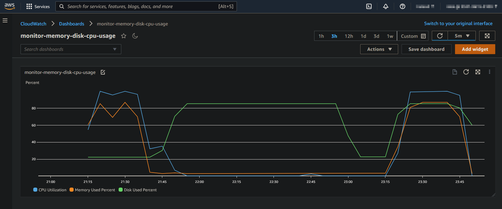
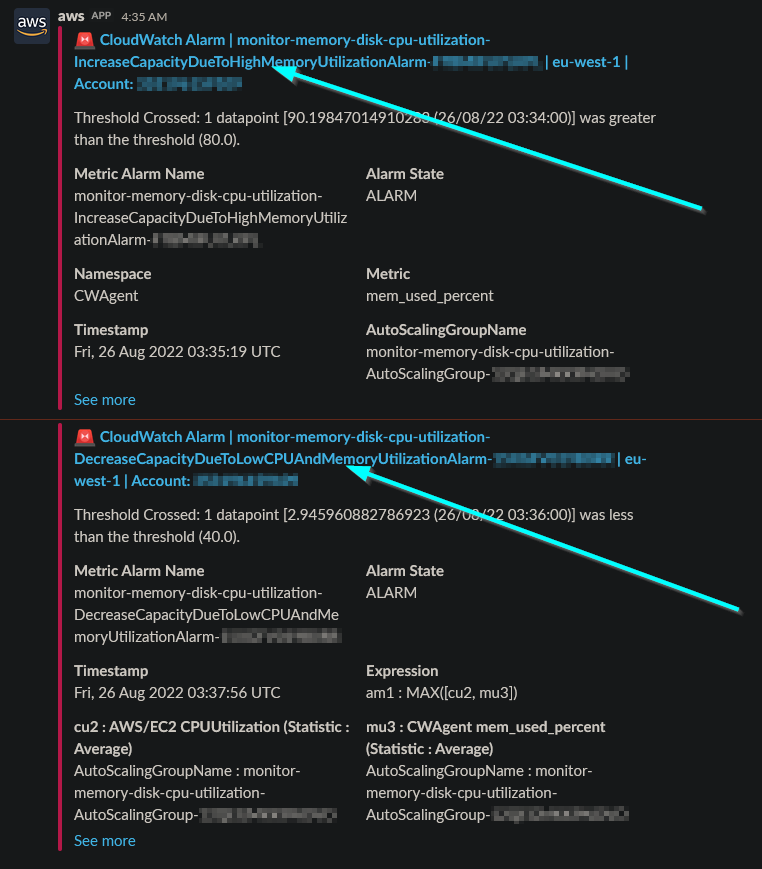

# Monitor memory, disk, and CPU utilization. Auto-scale.
> 1. Monitor EC2 memory, disk, and CPU utilization using CloudWatch agent. 
> 2. Create dashboard with the metrics, and alert through slack when any alarm goes in alert status.
> 3. Auto increase EC2 desired capacity, through CloudWatch alarm, when CPU **OR** memory utilisation is greater than a threshold.
> 4. Auto decrease EC2 desired capacity, through CloudWatch alarm, when CPU **AND** memory utilisation is lower than a threshold.



## Stress Test
```sh
sudo amazon-linux-extras install -y epel
sudo yum install -y stress htop

# CPU, and memory stress. t3.medium 2 CPU, 4GB memory
sudo stress --cpu 2 --vm-bytes $(awk '/MemAvailable/{printf "%d\n", $2 * 0.9;}' < /proc/meminfo)k --vm-keep -m 5

# Memory stress. t3.medium CPU, 4GB memory
sudo stress --vm-bytes $(awk '/MemAvailable/{printf "%d\n", $2 * 0.9;}' < /proc/meminfo)k --vm-keep -m 5
 
 # Disk utilization. 8GB disk
df -h
dd if=/dev/urandom of=2GB.bin bs=64M count=32 iflag=fullblock
dd if=/dev/urandom of=3GB.bin bs=64M count=48 iflag=fullblock
df -h
```

## Debug
- The subnets are public to keep the stack simple; the focus is to showcase memory, cpu utilization and the autoscaling.
- Use the EC2 serial console to connect the instance.

The EC2 password is set to `secret` from the `UserData`. This is set ONLY for debugging purposes, so do we remove this command before using it on production.

## Slack


## Development
- `make samconfig.toml` Customise as per you needs. Requires [AWS::Chatbot::SlackChannelConfiguration](https://docs.aws.amazon.com/AWSCloudFormation/latest/UserGuide/aws-resource-chatbot-slackchannelconfiguration.html) from a different stack.
- `make deploy`

## Sources

- [Install CloudWatch Agent](https://docs.aws.amazon.com/AmazonCloudWatch/latest/monitoring/Install-CloudWatch-Agent.html)  
- [Metrics collected by the CloudWatch agent on Linux instances](https://docs.aws.amazon.com/AmazonCloudWatch/latest/monitoring/metrics-collected-by-CloudWatch-agent.html#linux-metrics-enabled-by-CloudWatch-agent)  
- [Inline CloudFormation Template](https://github.com/awslabs/aws-cloudformation-templates/blob/master/aws/solutions/AmazonCloudWatchAgent/inline/amazon_linux.template)  
- [Dashboard Body Structure](https://docs.aws.amazon.com/AmazonCloudWatch/latest/APIReference/CloudWatch-Dashboard-Body-Structure.html)
- [AWS::AutoScaling::AutoScalingGroup](https://docs.aws.amazon.com/AWSCloudFormation/latest/UserGuide/aws-properties-as-group.html)
- [AWS::AutoScaling::ScalingPolicy](https://docs.aws.amazon.com/AWSCloudFormation/latest/UserGuide/aws-resource-autoscaling-scalingpolicy.html)
