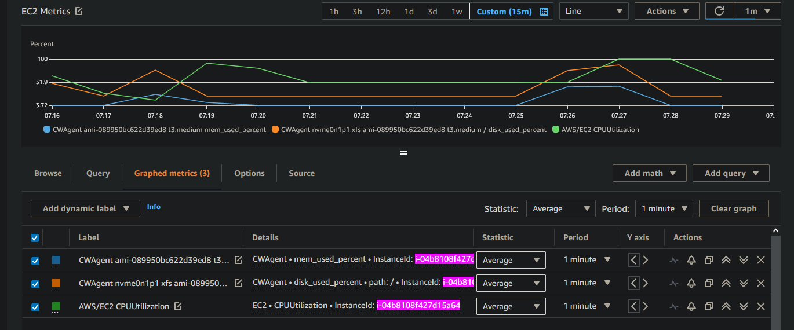

# Monitor memory and disk usage
Showcase monitoring memory and disk usage by install CloudWatch agent through CloudFormation on an EC2.



## Stress Test
```sh
sudo amazon-linux-extras install epel
sudo yum install stress-ng htop -y

# Run all the stress tests in parallel, for one minute, with 1 instance of each being run: 
sudo stress-ng --all 1 --timeout 1m
```

## Development
- `make samconfig.toml` && customise as per you needs
- `make deploy`

## Sources

[Install CloudWatch Agent](https://docs.aws.amazon.com/AmazonCloudWatch/latest/monitoring/Install-CloudWatch-Agent.html)  
[Linux](https://docs.aws.amazon.com/AmazonCloudWatch/latest/monitoring/metrics-collected-by-CloudWatch-agent.html#linux-metrics-enabled-by-CloudWatch-agent)  
[Inline CloudFormation Template](https://github.com/awslabs/aws-cloudformation-templates/blob/master/aws/solutions/AmazonCloudWatchAgent/inline/amazon_linux.template)
